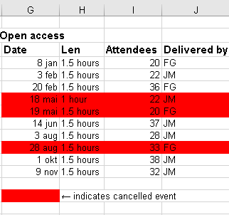
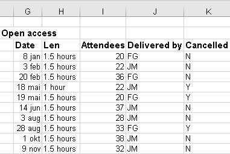
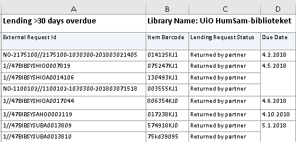

## Common Spreadsheet Errors

- [Multiple tables](#tables)
- [Multiple sheets](#shets)
- [Header pollution](#freezing)
- [Zero vs null](#zerovsnull)
- [Using formatting to convey information](#formatting)
- [Using formatting to make the data sheet look pretty](#formatting_pretty)
- [Placing comments or units in cells](#units)
- [More than one piece of information in a cell](#info)
- [Field name problems](#field_name)
- [Special characters in data](#special)
- [Inclusion of metadata in data table](#metadata)

---

## Multiple tables {#tables}

A common strategy is creating multiple data tables within one
spreadsheet. This is examplified in the figure below:

Although it is often useful to have many tables on the same spreadsheet by making the tables more accessible and simpler to visually compare, mentally group them, etc., it leads to difficulties in exporting to other formats such as csv. You will have to put each table into its own sheet (and as a seperate issue clean up the data) and export each sheet into its own csv-file. The example above depicts a typical visualization of data for reports etc, and isn't very practical to be doing analyses on.

## Multiple sheets {#sheets}

It is not easy to categorically state when it is beneficial to keep the data in one sheet, and when to split the data into separate sheets. A general rule could be to **put data that with the same columns** in the same sheet, and **only create a new sheet if the new data has a different set of columns**, i.e. **structure**. For example, if you do the same survey on library user behavior every year, it is better to keep all the data in the same sheet and not make a new one for each year: This makes it easier to compare data across years.  
But what happens if you add one question (say for age) which gives you an extra column? Should you then make a new sheet for the new data? Well, no. Just add the new column to existing sheet. Excel (and other programs) have ways of dealing with **missing data**, and you get the benefit of being able to compare the rest of the old data with the new in the same sheet.  
But what if you add two new questions, and maybe remove one, what then? Again, it is difficult to give a categorical answer, but if you see that the new data is **structurally too different**, i.e. have to many unshared columns, then you should place it in **a new sheet**.

## Header pollution {#freeze}
Sometimes the title headers of columns can get confused into the data analysis itself (for example sorting or summarizing). 
If you want to keep an overview of the column names in large datasets, you can freeze the column headers, so that they are visible at the top of thee screen no matter how far you scroll down.  

> ## Exercise: Freezing headers ##
> Download the [data](../data/Lending _30 days_overdue.xlsx)  
> 1. select the **first** row **below** the point you want to freeze (under the header).
>   You don't have to select the entire row, just one cell.
> 2. Go to the `View`-tab and click on the `Freeze panes` button.  
>   In the menu, chose `Freeze panes`.
>
> Try to scroll now, and see what happens!
>
> P.S. you can 'Unfreeze' the panes by going to the same menu and choosing `Unfreeze panes`.
{: .challenge}

## Zero vs null {#zerovsnull}

It might be that when you're measuring something, it's a zero, say if a patron reports never having used a certain service.
If this happens often and you get a lot of zeroes, why bother writing in the number zero in that column, when it's mostly zeros?

However, there's a difference between a zero and a blank cell in a spreadsheet. To the computer, a zero is actually data. You measured or counted it. A blank cell means that it wasn't measured and the computer will interpret it as a **null** value. A null value really means "nobody knows" to a computer, equivalent to leaving out data, which is very different from knowing that something has a specific value of zero. If you use blanks for zeroes or zeroes for blanks it will cause all sorts of problems for your analyses.
Most spreadsheet programs accept a completely empty cell as null, so if you have no data, **leave the cell empty!**  

## Using formatting to convey information  {#formatting}

**Example**: Highlighting cells, rows or columns that should be excluded from an analysis.

**Solution**: Create a new field (Cancelled) to mark the data to exclude.

## Using formatting to make the data sheet look pretty {#formatting_pretty}

**Example**: Merged cells. If you’re not careful, formatting a worksheet to be more aesthetically pleasing can compromise the spreadsheet program's ability to preform analyses. In the example below, the spreadsheet program would not be able to sort the 'Due Date' column because of empty cells.

**Solution**:  Make sure to not have empty cells if you actually have data for those cells (see null values above) and avoid merging cells with similar value.

> ## Exercise: Unmerging cells ##
> 
> Say for example that you have been given the sheet in the figure above where  
> the 'Due Date' column has been merged on similar date values. What problems will this cause?  
> Open the 'Lending 30 days_overdue.xlsx' that we worked on in the previous exercise and try to sort the table by 'Due Date'.  
>   
> What happens?
>
> Do you see how doing analyses on a prettified apreadsheet can be a pain?  
>
> > ## Solution
> > **Fret not!** Many spreadsheet programs have a of way fixing merged cells without you having to waste time on it.
> > In Excel, you solve this in two steps: First, unmerge the cells. Second, replicate the content of the newly unmerged celles.
> > 1. Unmerge cells:  
> >   Select the entire 'Due Date' column.  
> >   Click on the `Home`-tab and then click on the little upside-down triangle next to `Merge & Center`.  
> >   In the menu that appears, `Unmerge cells`.  
> > 
> > 2. Copy values into the newly unmerged cells (a bit tricky):
> >   Select the entire 'Due Date' column again.  
> >   Go to `Home` -> `Find and Select` -> `Go to special...` -> `Blanks` and click `Ok`.  
> >   This wil select all the blanck cells in the column. Without **selecting anything else**  
> >   (if you do you have to do this part again, this is the tricky part), write `=`, press **arrow key down**  
> >   and then `Ctrl`+`Enter`.
> >   If you did this correctly, the cells in the 'Due Date' will now be unmerged and filled with dates.  
> >   Now try sorting the table with the 'Due Date'-column and see what happens!
> > 
> {: .solution}
{: .challenge}

## Placing comments or units in cells {#units}

**Example**: You have an uncertain date for training course data marked with a question mark, like  this 02.06.20167?

**Solution**: Spreadsheet programs (like Excel), unlike humans, do not understand that by placing a question mark at the end of a value specifies that the value is uncertain. As described above for formatting, create another field if you need to add notes to cells. Similarly, don’t include units in cells, for example if you have a column for hours, don't put in "1,5h" or "1,5 hours". Also make sure that the measurements you place in one column are of the same unit, i.e. don't enter minutes in a column specified for hours. 

## More than one piece of information in a cell {#info}

**Example**: In the Book-column from the example in the introduction lesson, both title and year were placed in the same column.

**Solution**: Never include more than one piece of information in a cell. Create a good structure for your data before you start filling in information, make enough columns so that you have a precicely named column for each data type, i.e. "Title", "Year".

## Field name problems {#field_name}
Like stated above, make sure to give columns names that leave no doubt to what the contents are. Try to avoid having column names that are too similar to each other. Also avoid having too verbose and long names.

## Special characters and Rich text {#special}

**Example**: You treat Excel as a word processor when writing notes, even copying data directly from Word or other applications.

**Solution**: This is a common strategy. For example, when writing longer text in a cell, people often include line breaks in their spreadsheet.  Worse yet, when copying data in from applications such as Word, formatting and fancy non-standard characters (such as left- and right-aligned quotation marks) are included. When exporting this data into other formats such as csv-files, dangerous things may occur, such as lines being cut in half. To deal with "rich text" such as the text copied from Word, you can place the text in an intermediate program such as "Notepad" that changes the text into a simpler one and makes any hidden code visbile so that you can tidy up the text.

General best practice is to avoid adding special characters such as newlines, tabs, pipes and backslashes (backslashes can be particularly evil). Try to have your cells contain only the content that they absolutely need, such as numbers, text and spaces. Obviously there are exceptions, you will sometimes need periods (in dates), quotation marks, apostophes, dashes, etc., but don't use them haphazardly. 

## Inclusion of metadata in data table {#metadata}

**Example**: You add a legend at the top or bottom of your data table explaining column meaning, units, exceptions, etc.

**Solution**: While recording data about your data ("metadata") is essential, this information should not be contained with the data itself. Unlike a table in a paper or a supplemental file, metadata (in the form of legends) should not be included, since this information is not data. While you can work around it when you only use a spreadsheet program like Excel, it will ruin a csv-file. If you need metadata, it should be stored as a separate sheet. Because such "metadata sheets" can contain free text, you are free to copy and paste from Word, have prettified tables, include special characters and so on.

> ## Exercise
>
> We're going to take a messy version of some library training data and clean it up
>
> 1. First [download the data](../data/training_attendance.xlsx)
> 2. Open up the data in a spreadsheet program
> 1. You can see that there are two tabs. Various people have recorded
  training attendance statistics over 2016 and 2017, and they have
  kept track of the data in their own way. Now you're being asked to
  evaluate the training programme and you want to be able to start
  working with the data.
> 1. With the person next to you, work on the messy data so that there is only  
  one value per cell and that all values in the same column have the same format.  
  Clean up the 2016 and 2017 tabs, and put them all together in one spreadsheet.
  We have made a "Solutions" sheet with all the columns titles ready-made to help  
  you get going - paste in the data there and refine it, do not change the original sheets!
> 1. After you go through this exercise, we'll discuss as a group what you think was wrong
with this data and how you fixed it. 
{: .challenge}

<!-- *Instructors see notes in 'instructors_notes.md' on this exercise.* -->

