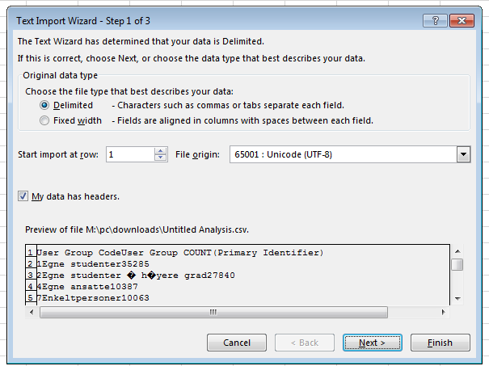
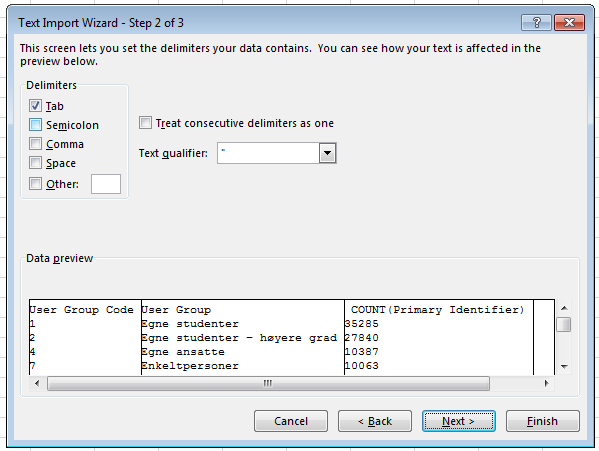

## Exporting data as CSV

The default Excel file format (`*.xls` or `*.xlsx` - depending on the Excel
version) works well in many cases, but for **archiving/long-term storage** or
for **publishing/sharing** your data, there's some reasons to consider alternatives:

- The Excel format is a *proprietary format*, linked to a specific piece of (non-free)
  software (Excel). Other software may not be able to open the files correctly.
  - This is less of an issue with Excel files than many other proprietary
    formats though. The ubiquity of Excel has led to good third-party support
    for the format, and there's no shortage of *free* and *open* software with
    good support for the format.

- The format changes over time together with the software itself.
  Different versions of Excel may handle data differently, leading to inconsistencies. 

- It's a *very complex* file format. This is an issue that is often overlooked,
  but for long-term storage it's imporant to keep in mind.
  The more flexible and complex a file format is, the more things can go wrong,
  and thus the greater the chance that something actually does go wrong.
  - The *complexitity* issue is not only an issue with the Excel format, but also the
    Open Document Format (ODF).
  - More complexity also means that more processing power and memory is needed to work
    with the files. Not something you have to worry about on your everyday spreadsheet,
    but for large datasets or automated data processing, it can be a reason to choose
    an alternative.

<!-- - Finally, more **journals and grant agencies** are requiring you -->
<!--   to deposit your data in a data repository, and most of them **don't -->
<!--   accept Excel format**. It needs to be in one of the formats -->
<!--   discussed here. -->

As an example, do you remember how we talked about how Excel stores **dates** earlier? Turns out there are **multiple defaults for different versions of the software**. And you can switch between them all willy-nilly. So, say you’re compiling Excel-stored data from multiple sources. There’s dates in each file- Excel interprets them as their own internally consistent serial numbers. When you combine the data, Excel will take the serial number from the place you’re importing it from, and interpret it using the rule set for the version of Excel you’re using. Essentially, you could be adding a huge error to your data, and it wouldn’t necessarily be flagged by any data cleaning methods if your ranges overlap.

Storing data in a **universal**, **open**, **static format** will help deal with this problem. Try **tab-delimited** or **CSV** (more common). CSV files are plain text files where the columns are separated by commas, hence 'comma separated variables' or CSV. The advantage of a CSV over an Excel/SPSS/etc. file is that we can open and read a CSV file using just about any software, including a simple **text editor**. Data in a CSV can also be **easily imported** into other formats and environments, such as SQLite and R. We're not tied to a certain version of a certain expensive program when we work with CSV, so it's a good format to work with for maximum portability and endurance. Most spreadsheet programs can save to delimited text formats like CSV easily.

To save a spreadsheet as CSV:

1. From the top menu select 'File' and 'Save as'.
2. In the 'Format' field, from the list, select 'Comma Separated Values' (`*.csv`).
3. Double check the file name and the location where you want to save it and hit 'Save'.


### Sometimes CSV is too simple

When it comes to data exchange and long-term storage, simplicity is king and CSV is perfect! 
For other use cases, the CSV format might be too simple though. The CSV format do not support
features like formatting (color, text style, etc.), merged cells, comments, figures, formulas, etc.

## Importing CSV files

The CSV format comes with some options that you need to be aware of when importing CSV files.
The most important are:

* **Separator**: The table cells in a CSV file can in principle be separated by any type of symbol as
  long as the file is consistent. The most common is comma (therby the name), but tab is also very
  common, and you might also come across semicolon.

* **Escape character** or **text qualifier**: If there's an actual comma symbol (or whatever separator token you have)
  within a cell, that value must be "escaped" in some way so it's not interpreted as a separator.
  Again, there's different ways to do this.

* **Character encoding**: As with other text files, a CSV file has a character encoding that determines how characters are stored.
  The de facto standard today is to use Unicode (UTF-8), which supports all the alphabets of the world
  and lots of other characters like technical symbols and emojis.
  Unfortunately, Excel still exports CSV files using legacy character encodings.
  LibreOffice is better in this case, as it provides you with an option of what character encoding to use.

Some software are quite smart when it comes to detecting these settings for you upon import.
Excel is not, but it provides you with an import wizard where you can select the settings yourself
by trying and failing. If you see question marks like this it means the file is encoded using
a different encoding than the one you have selected:



In this case, the file was encoded as a legacy encoding called "Windows (ANSI)" or 
"[CP-1252](https://en.wikipedia.org/wiki/Windows-1252)", which is limited to the Latin alphabet
with some extensions.

In the next step of the import, you can select the delimiter and text qualifier.
This is easier since there are fewer options, and Excel will preview the result.
For the text qualifier setting, the default value is also usually the correct one.




## A Note on Cross-platform Operability
(or, how typewriters are ruining your work)

By default, most coding and statistical environments expect UNIX-style line endings (`\n`) as representing line breaks.  However, Windows uses an alternate line ending signifier (`\r\n`) by default for legacy compatibility with Teletype-based systems.  As such, when exporting to CSV using Excel, your data will look like this:

>data1,data2\r\n1,2\r\n4,5\r\n…

which, upon passing into most environments (which split on `\n`), will parse as:

>data1<br>
>data2\r<br>
>1<br>
>2\r<br>
>...

thus causing terrible things to happen to your data.  For example, `2\r` is not a valid integer, and thus will throw an error (if you’re lucky) when you attempt to operate on it in R or Python.  Note that this happens on Excel for OSX as well as Windows, due to legacy Windows compatibility.

There are a handful of solutions for enforcing uniform UNIX-style line endings on your exported CSVs:

1. When exporting from Excel, save as a “Windows comma separated (.csv)” file
2. If you store your data file under version control (which you should be doing!) using Git, edit the `.git/config` file in your repository to automatically translate `\r\n` line endings into `\n`.
   Add the follwing to the file ([see the detailed tutorial](http://nicercode.github.io/blog/2013-04-30-excel-and-line-endings)):

   ```
   [filter "cr"]
   clean = LC_CTYPE=C awk '{printf(\"%s\\n\", $0)}' | LC_CTYPE=C tr '\\r' '\\n'
   smudge = tr '\\n' '\\r'` 
   ```
   
   and then create a file `.gitattributes` that contains the line:
 
   ```
   *.csv filter=cr
   ```
	
3. Use [dos2unix](http://dos2unix.sourceforge.net/) (available on OSX, *nix, and Cygwin) on local files to standardize line endings.

#### A note on Python and `xls`

There are Python packages that can read `xls` files (as well as
Google spreadsheets). It is even possible to access different
worksheets in the `xls` documents.

**But**

- this equates to replacing a (simple but manual) export to `csv` with
  additional complexity/dependencies in the data analysis Python code
- **data formatting best practice STILL apply**
- Is there really a good reason why `csv` (or similar) is not adequate?
