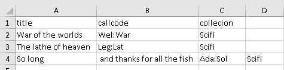

<!-- Materials by: **Jeffrey Hollister**, **Alexander Duryee**, **Jennifer Bryan**, **Daisie Huang**, **Ben Marwick**, **Christie Bahlai**, **Owen Jones**, **Aleksandra Pawlik** -->

## Commas as part of data values in `*.csv` files ##

In the [previous lesson](../05-exporting-data) we discussed how to export Excel file formats into `*.csv` (Comma Separated Value).  

Whilst Comma Separated Value files are indeed very useful allowing for easily exchanging and sharing data, there are some problems with formats such as this. Quite often the data values themselves may include commas (,). In that case, the software which you use (including Excel) will most likely incorrectly display the data in columns. It is because the commas which are a part of the data values will be interpreted as a delimiter.

For example, our data could look like this:
	
		title,callcode,collecion
		War of the worlds,Wel:War,Scifi
		The lathe of heaven,Leg:Lat,Scifi
		So long, and thanks for all the fish,Ada:Sol,Scifi

In the third record `So long, and thanks for all the fish,Ada:Sol,Scifi`, the title includes a comma. 
If we try to read the above into Excel (or other spreadsheet programme), we will get something like this:

The value for 'title' was split into two columns (instead of being put in one column `A`). Errors like these can propagate to a number of further errors. For example, the "extra" column will be interpreted as a column with many missing values (and without a proper header!). In addition to that, the values in column `B` (callcode) and `C` (collection) are now incorrect. 
 

## Dealing with commas as part of data values in `*.csv` files ##

If you want to store your data in `*.csv` and expect that your data may contain commas in their values, you can avoid the problem discussed above by putting the values in quotes (""):

		title,callcode,collecion
		War of the worlds,Wel:War,Scifi
		The lathe of heaven,Leg:Lat,Scifi
		"So long, and thanks for all the fish",Ada:Sol,Scifi
	
However, if you are working with already existing dataset in which the data values are not included in "" and but which have commas as both delimiters and parts of data values, you are potentially facing a major problem with **data cleaning**.

> ## Challenge: Importing a CSV file ##
> 
> 1. Download the CSV file with the bad formatting (missing quotes) [incorrectly_formatted.csv](../data/incorrectly_formatted.csv)
> 2. Like in the previous lesson (Importing and exporting data), to import the csv-file, go to the 'Data' tab, click `From text` and locate the csv-file that you downloaded.
> 3. Use the info from the 'Importing CSV files' section in the previous lesson and see how it ends up looking.
> 4. Delete the imported data from Excel and open the csv-file in a text editor (like Notepad), try adding quotation marks around the title with commas and re-import. How does it look now?
> 
{: .challenge}

If the dataset you're dealing with contains hundreds or thousands of records, cleaning them up manually, might not only to take hours and hours, but may potentially end up with you accidentally introducing errors.

Cleaning up datasets is one of major problems in many scientific disciplines. The approach almost always depends on the particular context. However, it is a good practice to clean the data in an automated fashion, for example by writing and running a script. Other lessons in Data Carpentry covering shell, Python and R will give you the basis for developing skills to build relevant scripts.
